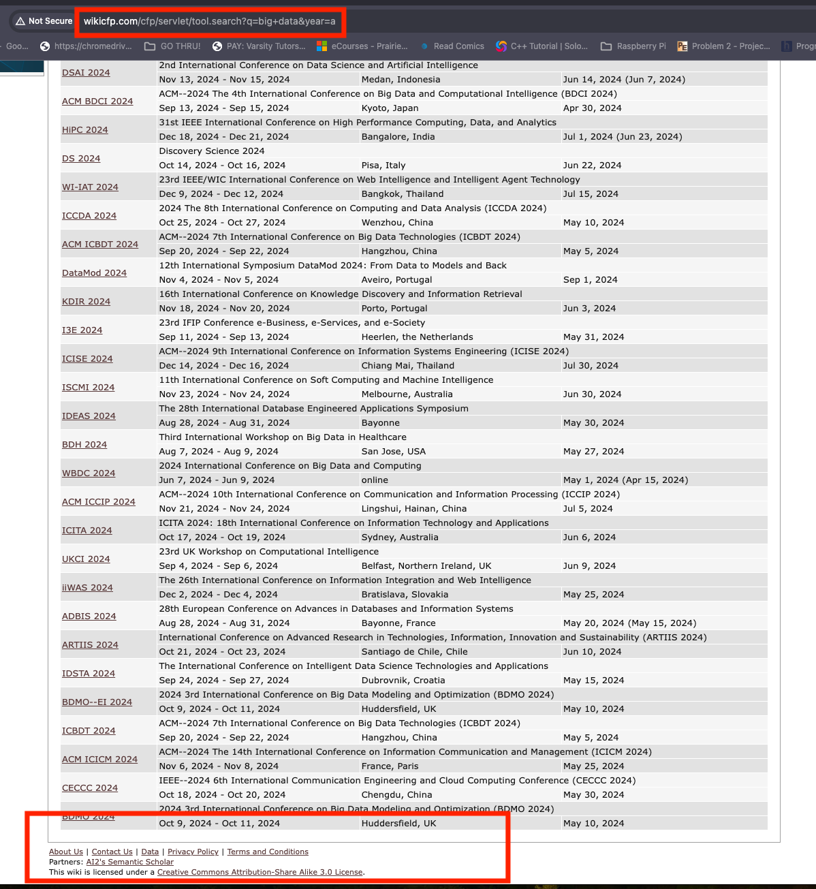

# DB_HW_2
This is the 2nd homework assignment for topics in databases.


## Exercise 1: Data Crawling
Crawl WikiCFP for "Big Data", "Machine Learning", and "Artificial Intelligence" conferences and their
location every year.
Crawl all 20 pages for big data, machine learning and artificial intelligence.
The output of the crawling should be in the tab separated format:
```
conference_acronym  conference_name conference_location
```
* The policy states at most 1 query per 5 seconds, so please set the limiter to 9 or 10 seconds (it might take a bit longer to run so you might want to let your crawler run and go
to dinner and/or watch a movie in the meanwhile).

### Setup

* venv
* python requirements
    * python version
    * requests
    * bs4
    * pandas
    * selenium
        * selenium==4.18.1 (for requirement.txt)

### Errors 
Big data doesn't have 20 pages.
* [Link for proof](http://www.wikicfp.com/cfp/servlet/tool.search?q=big+data&year=a)
* 
The solution to this issue is to just the links the professor supplied.

## Exercise 2
TODO write about consider cases such as empty locations/online, repeatedly posted conferences, etc.

## Exercise 3
### Number of Conferences per City
### TODO
* add s to conferences
* replace universities with city names
* Tuscany case
* JNTata Auditorium IISc which is now J
* Laguna Hills California
* Lugano-Viganello vs Lugano
* Book by Qusay F
* MNIT Jaipur
* Washington D
### Steps
* hdfs dfs -rm -r -f /user/shanemay/exercise_3/output/num_conference_per_city    
* `hadoop namenode -format`
* Run: `start-all.sh`
* Go to: http://localhost:9870
* `hdfs dfs -mkdir -p /user/shanemay/exercise_3/input`
* `hdfs dfs -put MAY_conference_data.csv /user/shanemay/exercise_3/input`
```
hadoop jar /opt/homebrew/Cellar/hadoop/3.3.6/libexec/share/hadoop/tools/lib/hadoop-streaming-3.3.6.jar \
-file "num_conference_per_city_mapper.py"     -mapper "num_conference_per_city_mapper.py"  \
-file "num_conference_per_city_reducer.py"   -reducer "num_conference_per_city_reducer.py" \
-input /user/shanemay/exercise_3/input/MAY_conference_data.csv -output /user/shanemay/exercise_3/output/num_conference_per_city
```

# TODO input execution screenshots

```hadoop fs -get /user/shanemay/exercise_3/output/num_conference_per_city num_conference_per_city```

```python3 hadoop_output_sorter.py num_conference_per_city/part-00000 MAY_num_conf_per_city.csv count```

# TODO input screenshot of num_conference_per_city output

```python3 plot_num_conferences_per_city.py```

# TODO input screenshot of num_conference_per_city graph outpu

* 1 mapper and 1 reducer 
    * show image of mapper and reducer. MAKE SURE TO EXPLAIN THEM AS IF THEY CAN'T OPEN THE FILE AND READ.
* create plot
    * show image of squished plot
    * explain that 185 bars isn't reflective of a data scientists' actual work and doesn't convey the information clearly.
    * create graph of top ten cities
    

### List of Conferences per City
* 1 mapper and 1 reducer
# TODO mention why you chose acronym and how you took out the year
```
hadoop jar /opt/homebrew/Cellar/hadoop/3.3.6/libexec/share/hadoop/tools/lib/hadoop-streaming-3.3.6.jar \
-file "list_conf_per_city_mapper.py"     -mapper "list_conf_per_city_mapper.py"  \
-file "list_conf_per_city_reducer.py"   -reducer "list_conf_per_city_reducer.py" \
-input /user/shanemay/exercise_3/input/MAY_EXERCISE_2_OUTPUT.csv -output /user/shanemay/exercise_3/output/list_conf_per_city
```
```hadoop fs -get /user/shanemay/exercise_3/output/list_conf_per_city list_conf_per_city```
#### Sort Cities By Number of Conferences
```python3 hadoop_output_sorter.py list_conf_per_city/part-00000 MAY_list_conferences_per_cities.csv list```

### List of Cities Per Conference (regardless of year)
# TODO mention why you chose acronym and how you took out the year
* 1 mapper and 1 reducer
#### Cleaning Conference Names
* remove part with parathensis
* remove any numeric part
# TODO make sure to write about:
* why chose title over acronym
* compare acronym vs title
* suspected conferences being the same but different ending title
* locations like university
```
hadoop jar /opt/homebrew/Cellar/hadoop/3.3.6/libexec/share/hadoop/tools/lib/hadoop-streaming-3.3.6.jar \
-file "list_cities_per_conf_mapper.py"     -mapper "list_cities_per_conf_mapper.py"  \
-file "list_cities_per_conf_reducer.py"   -reducer "list_cities_per_conf_reducer.py" \
-input /user/shanemay/exercise_3/input/MAY_EXERCISE_2_OUTPUT.csv -output /user/shanemay/exercise_3/output/list_cities_per_conf
```

```hadoop fs -get /user/shanemay/exercise_3/output/list_cities_per_conf list_cities_per_conf```

```python3 hadoop_output_sorter.py list_cities_per_conf/part-00000 MAY_list_cities_per_conf.csv list```

Show MAY_list_cities_per_conf.csv file

### Number of Conferences per City per Year (Time Series Plot)
    * create plot
    * not limited to 1 mapper and 1 reducer

